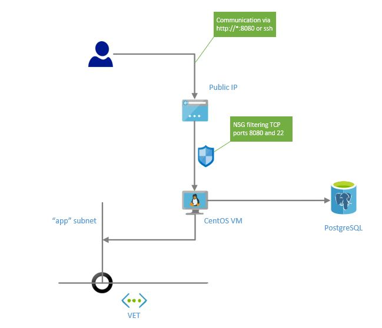

# Single VM deployment with PostgreSQL

Deploying single VM with public IP address, VM will be installed automatically by extension script. 

Installation requires prepared RPM package stored somewhere - in our case we are using Azure blob storage.

Script will deploy:

* Linux (CentOS) based VM with public IP address and Network Security Group exposing ports 8080 and 22
* PostgreSQL database as service
* automatically install and configure our simple JAVA app to run as a system service in CentOS (script `install.sh` is used for installation)

Final architecture picture:


```bash
# go to directory with our experiment
cd 01-simplevm
```

```bash
export RG=TST_01
export LOCATION=northeurope

# create resource group
az group create --location ${LOCATION} --name ${RG}

# run deployment
az group deployment create -g ${RG} --template-file azuredeploy.json --parameters \
    username="valda" \
    sshkey="$(cat ~/.ssh/id_rsa.pub)" \
    postgrename="valdatst01" \
    postgreuser="valda" \
    postgrepassword="pwd123..." \
    rpmurl="${RPM}" \
    artifactsLocation="https://raw.githubusercontent.com/valda-z/IaaC/master/01-singlevm/install.sh"

```

Now you can use Azure portal and navigate to your Resource group, on the VM resource you can grab public IP address and try to connect to our JAVA web application on port 8080.
`http://<YOUR_IP_ADDRESS>:8080`