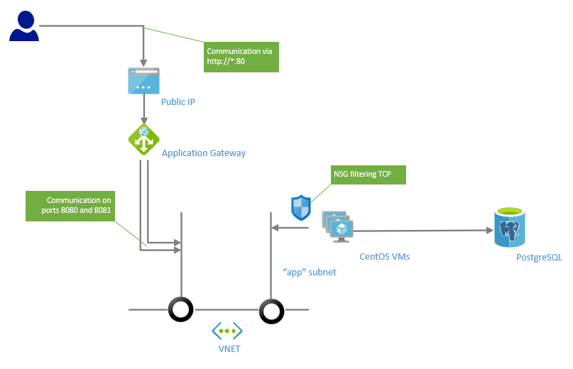

# VM Scale Set balanced by Application Gateway with PostgreSQL

Deploying VM scale set with application gateway, VMs will be installed automatically by extension script. 

Installation is done by creating systemd service which runs docker containers with our app (SPA container and REST API for ToDoes container) orchestrated by docker-compose.

Script will deploy:

* Linux (CentOS) based VMs with private IP address and Network Security Group enabling communication only from local VNET 
* PostgreSQL database as service
* create systemd service which runs two containers by docker-compose (myappspa and myapptodo), containers are pulled from Azure Container Registry
* Application gateway with public IP address has deployed URL path mapping rules which are sending traffic to path `/api/todo` to myapptodo service (running on port 8081) and rest of traffic to myappspa service (running on port 8080).

Final architecture picture:


```bash
# go to directory with our experiment
cd 04-vmssappgw
```

```bash
export RG=TST_04
export LOCATION=northeurope

# create resource group
az group create --location ${LOCATION} --name ${RG}

# run deployment
az group deployment create -g ${RG} --template-file azuredeploy.json --parameters \
    username="valda" \
    sshkey="$(cat ~/.ssh/id_rsa.pub)" \
    vmcount="3" \
    postgrename="valdatst04" \
    postgreuser="valda" \
    postgrepassword="pwd123..." \
    acrname="${ACR_NAME}" \
    acrkey="${ACR_KEY}" \
    acrimgspa="${ACR_URL}/myappspa:v1" \
    acrimgtodo="${ACR_URL}/myapptodo:v1" \
    artifactsLocation="https://raw.githubusercontent.com/valda-z/IaaC/master/04-vmssappgw/install.sh"

```

Now you can use Azure portal and navigate to your Resource group, on the `load balancer` resource you can grab public IP address and try to connect to our JAVA web application on standard http port 80.
`http://<YOUR_IP_ADDRESS>`