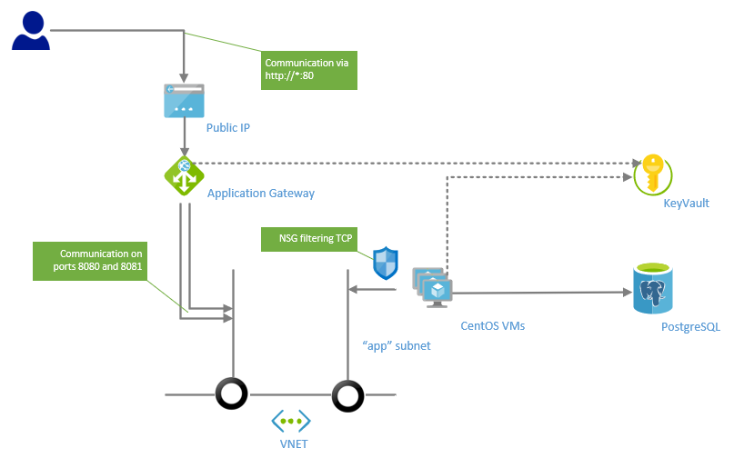

# VM Scale Set balanced by Application Gateway with PostgreSQL, all security assets stored in KeyVault

Deploying VM scale set with application gateway, VMs will be installed automatically by extension script. 

Installation is done by creating systemd service which runs docker containers with our app (SPA container and REST API for ToDoes container) orchestrated by docker-compose.

All security assets stored in KeyVault service (password for SQL server and SSL certificate for SSL offload), security assets are accessed by `user managed identity` which have access to KeyVault. 

Script will deploy:

* Linux (CentOS) based VMs with private IP address and Network Security Group enabling communication only from local VNET 
* PostgreSQL database as service
* create systemd service which runs two containers by docker-compose (myappspa and myapptodo), containers are pulled from Azure Container Registry
* Application gateway with public IP address has deployed URL path mapping rules which are sending traffic to path `/api/todo` to myapptodo service (running on port 8081) and rest of traffic to myappspa service (running on port 8080).
* Application gateway will listen on ports 80 (for standard HTTP) and 443 (for HTTPS), we will use self sign certificate in base64 encoding, certificate and password are stored in template like default parameters.

Final architecture picture:


```bash
# go to directory with our experiment
cd 05-vmssappgw-keyvault
```

```bash
export RG=TST_05
export LOCATION=northeurope
# please use your unique name for keyvault!
export KEYVAULT=valdakv05

# create resource group
az group create --location ${LOCATION} --name ${RG}

# create keyvault in resource group
az keyvault create --name ${KEYVAULT}                       \
                   --resource-group ${RG}                   \
                   --location ${LOCATION}                   \
                   --enabled-for-deployment true            \
                   --enabled-for-disk-encryption true       \
                   --enabled-for-template-deployment true   \
                   --sku standard
export KEYVAULTID="$(az keyvault show -n ${KEYVAULT} -g ${RG} --query "id" -o tsv)"

# generate random password for PostgreSQL and store it in keyvault (24 chars)
az keyvault secret set --name postgres-secret           \
                       --value "$(openssl rand -base64 24)"    \
                       --vault-name ${KEYVAULT}

# import our PFX certificate (also we can use keyvault to generate our certificates)
az keyvault certificate import  --vault-name ${KEYVAULT} \
                                -n appgwcert             \
                                -f mycert.pfx --password ""
# get certificate ID for application gateway
export CERTSID="https://${KEYVAULT}.vault.azure.net/secrets/appgwcert/"

# create identity
az identity create -n appidentity -g ${RG}
export IDENTITYID="$(az identity show -n appidentity -g ${RG} --query "id" -o tsv)"
export IDENTITYCLIENTID="$(az identity show -n appidentity -g ${RG} --query "clientId" -o tsv)"
export IDENTITYPRINCIPALID="$(az identity show -n appidentity -g ${RG} --query "principalId" -o tsv)"
# assign identity to keyvault
az keyvault set-policy -n ${KEYVAULT} --secret-permission get --object-id ${IDENTITYPRINCIPALID}
# assign identity to ACR
az role assignment create --assignee ${IDENTITYPRINCIPALID} --scope ${ACR_ID} --role acrpull

# run deployment
az group deployment create -g ${RG} --template-file azuredeploy.json --parameters \
    username="valda" \
    sshkey="$(cat ~/.ssh/id_rsa.pub)" \
    vmcount="3" \
    postgrename="valdatst05" \
    postgreuser="valda" \
    postgrepassword="$(az keyvault secret show -n postgres-secret --vault-name  ${KEYVAULT} --query 'value' -o tsv)" \
    acrname="${ACR_NAME}" \
    identityid="${IDENTITYID}" \
    identityprincipalid="${IDENTITYPRINCIPALID}" \
    keyvault="${KEYVAULT}" \
    appgwCertSID="${CERTSID}" \
    acrimgspa="${ACR_URL}/myappspa:v1" \
    acrimgtodo="${ACR_URL}/myapptodo:v1" \
    artifactsLocation="https://raw.githubusercontent.com/valda-z/IaaC/master/05-vmssappgw-keyvault/install.sh"

```

Now you can use Azure portal and navigate to your Resource group, on the `Application Balancer` resource you can grab public IP address and try to connect to our web application on standard http port 80.
`http://<YOUR_IP_ADDRESS>`
If it works you can also check if SSL connection to our application is working on address:
`https://<YOUR_IP_ADDRESS>`